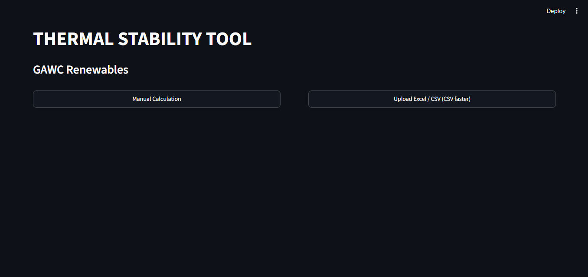
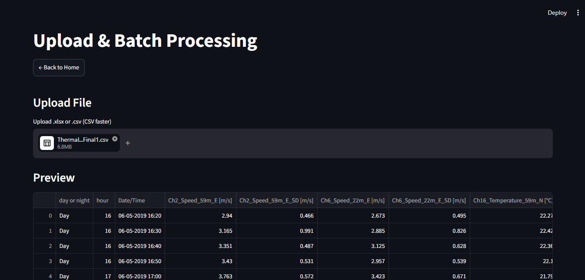
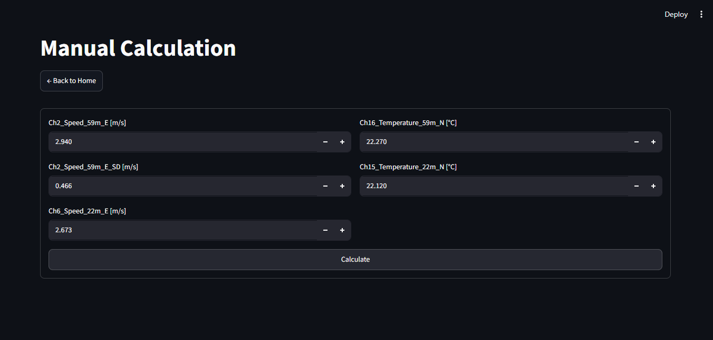
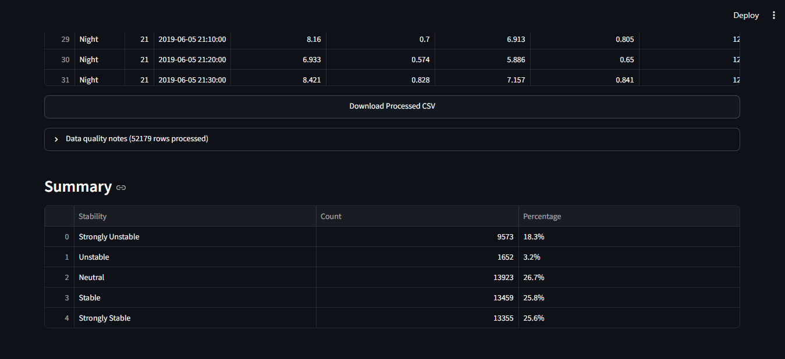
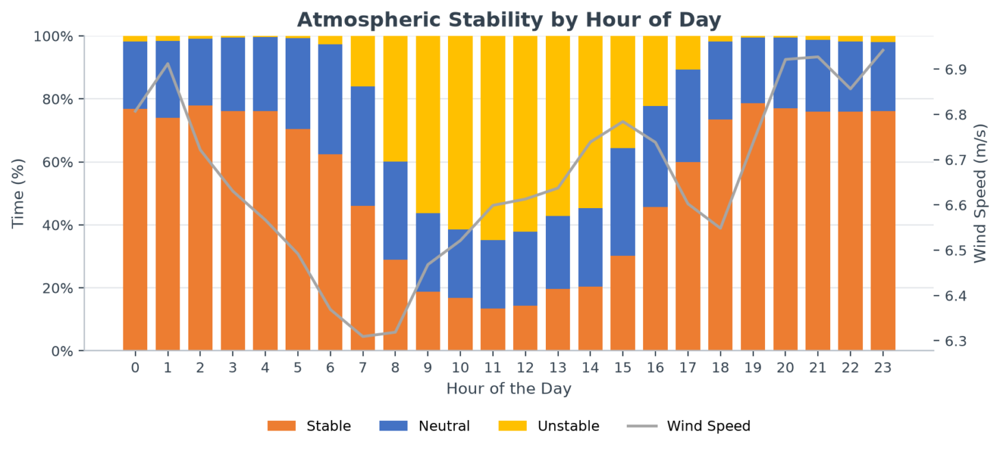
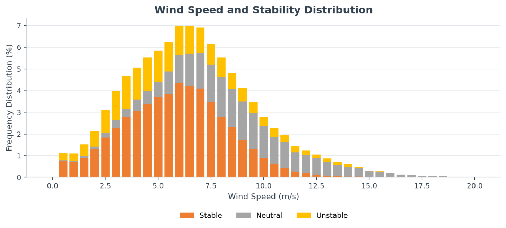
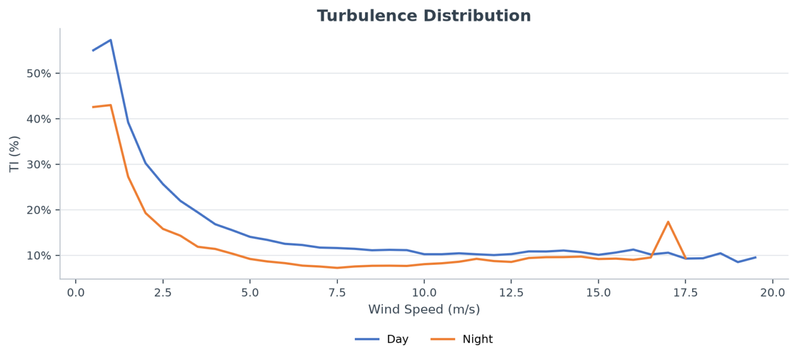

# Thermal Stability Analysis Tool (Method 2)

A Python-based web application for calculating **Atmospheric Thermal Stability** using meteorological data collected from wind masts. This application automates the calculations previously performed in an Excel-based Thermal Stability Tool by implementing **Method 2** and provides interactive visualizations along with downloadable results.

Have a live Demo - https://thermal-stability-tool-bmkrrvfq7mjmh2unbsltvw.streamlit.app/

---

## Project Overview

Atmospheric stability plays a vital role in **Wind Resource Assessment (WRA)**, environmental monitoring, and renewable energy studies. Traditionally, stability calculations were performed manually using Excel formulas, making the process time-consuming and prone to errors.

This project converts the Excel workflow into a user-friendly web application that automatically computes atmospheric stability parameters, classifies atmospheric conditions, and visualizes the results.

---

## Features

- Upload meteorological datasets (CSV/XLSX)
- Automatic input validation
- Implements **Method 2** calculations
- Calculates all required atmospheric parameters
- Automatic Atmospheric Stability Classification
- Interactive data table
- Download processed results
- Graphical visualization of calculated parameters
- Fast and user-friendly interface

---

# Screenshots

## Home Page



---

## Upload Dataset



---

## Manual Calculation



---

## Calculated Results



---

## Graph 1



---

## Graph 2



---

## Graph 3



---

## Export Results


---

# Parameters Calculated

The application automatically computes the following parameters:

| Parameter | Description |
|------------|-------------|
| RI | Richardson Number |
| WS Bin | Wind Speed Bin Classification |
| TI | Turbulence Intensity |
| Shear | Wind Shear |
| WS120 | Wind Speed at 120 m |
| ΔT | Temperature Difference |
| Stability | Atmospheric Stability Classification |

---

# Input Parameters

The application accepts the following meteorological measurements:

- Wind Speed at multiple sensor heights
- Temperature at multiple sensor heights

The uploaded data is validated before performing calculations.

---

# Atmospheric Stability Classification

The calculated Richardson Number (RI) is used to classify atmospheric stability into categories such as:

- Strongly Unstable
- Unstable
- Neutral
- Stable
- Strongly Stable

---

# Workflow

```text
                 Upload Dataset
                        │
                        ▼
               Validate Input Data
                        │
                        ▼
           Calculate Derived Parameters
                        │
                        ▼
            Richardson Number (RI)
                        │
                        ▼
             Wind Speed Bin (WS Bin)
                        │
                        ▼
           Turbulence Intensity (TI)
                        │
                        ▼
             Wind Shear Calculation
                        │
                        ▼
         Wind Speed at 120 m (WS120)
                        │
                        ▼
         Temperature Difference (ΔT)
                        │
                        ▼
      Atmospheric Stability Classification
                        │
                        ▼
          Generate Tables & Graphs
                        │
                        ▼
             Download Processed Data
```

---

# Technologies Used

- Python
- Streamlit
- Pandas
- NumPy
- OpenPyXL
- Matplotlib

---

# Project Structure

```text
thermal-stability-tool/
│
├── app.py
├── requirements.txt
├── README.md
├── .gitignore
│
├── data/
│   ├── Thermal_stability_Final1.csv
│   └── Thermal_stability_Final1.xlsx
│
├── sample input files/
│   ├── dummy_thermal_stability_input.xlsx
│   └── sample_met_mast_data.xlsx
│
├── src/
│   ├── __init__.py
│   ├── calculations.py
│   ├── charts.py
│   ├── constants.py
│   └── validation.py
│
├── notebooks/
│   └── analysis.ipynb
│
└── images/
    ├── home-page.png
    ├── upload-file.png
    ├── manual-calc.png
    ├── graph1.png
    ├── graph2.png
    ├── graph3.png
    └── summary-export.png
```

# Output

The application generates:

- Richardson Number (RI)
- Wind Speed Bin
- Turbulence Intensity (TI)
- Wind Shear
- Wind Speed at 120 m
- Temperature Difference (ΔT)
- Atmospheric Stability Classification
- Downloadable Output File

---

# Advantages

- Eliminates manual Excel calculations
- Faster processing of meteorological data
- Reduces calculation errors
- Interactive visualizations
- Easy-to-use web interface
- Downloadable processed results

---

# Contributors

- **Manish Rao**
- **Ishta**

---

# Acknowledgement

This project was developed as part of a technical assignment for automating the **Thermal Stability Analysis Tool** used in **Wind Resource Assessment (WRA)**. The objective was to transform an Excel-based workflow into a scalable Python/web application implementing **Method 2** calculations.


